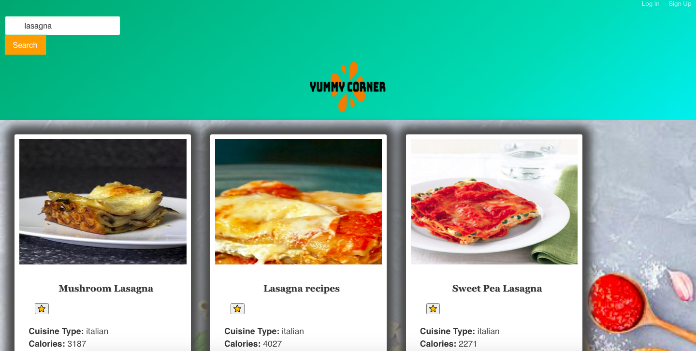

# Description
Welcome to the Yummy Corner — a JavaScript recipe search engine application for all your cooking needs; from deciding what to make to the ingredients needed to the actual recipe of your dish. All while keeping UX & UI in focus.

# Technologies used
Project was created using:

- Bulma
- Edamam API
- Express
- Node
- Sequelize
- Lozad

# Installation
Visit this link to view the app: https://recipe-search-project.herokuapp.com/

# Instructions
WHEN I enter a search input (example: lasagna)

THEN I am presented with a list of recipes that meet the search criteria.

WHEN I click on a food recipe

THEN I am directed to a URL with complete instructions

WHEN I search for a new recipe

THEN the previous results are cleared and only the new results are shown

WHEN I sign-up and log-in

THEN I am able to add Recipes to my "Favorites" list

# Screenshots

Sign-up Page:

Log-in Page:

Search Page:

# Contributors
- Abbey Schueller - https://github.com/abbeyschu
- Raya Alsaedi - https://github.com/rayaalsaedi
- Matt Dragin - https://github.com/Mdragin
- Perlum Toombs - https://github.com/ClarkT06
